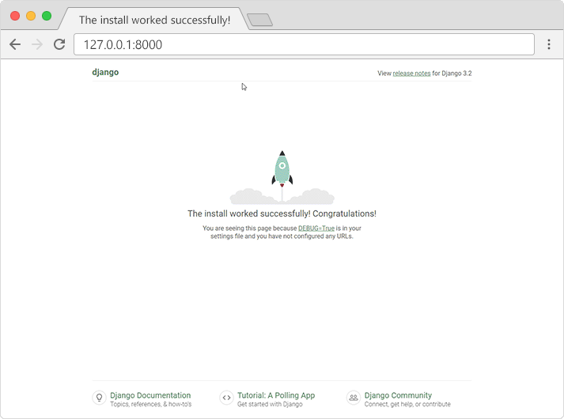
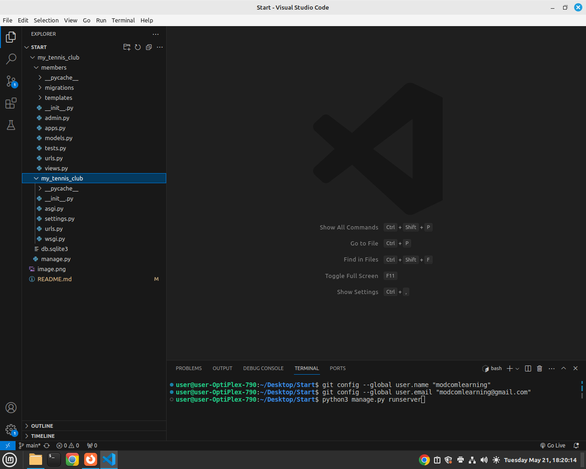
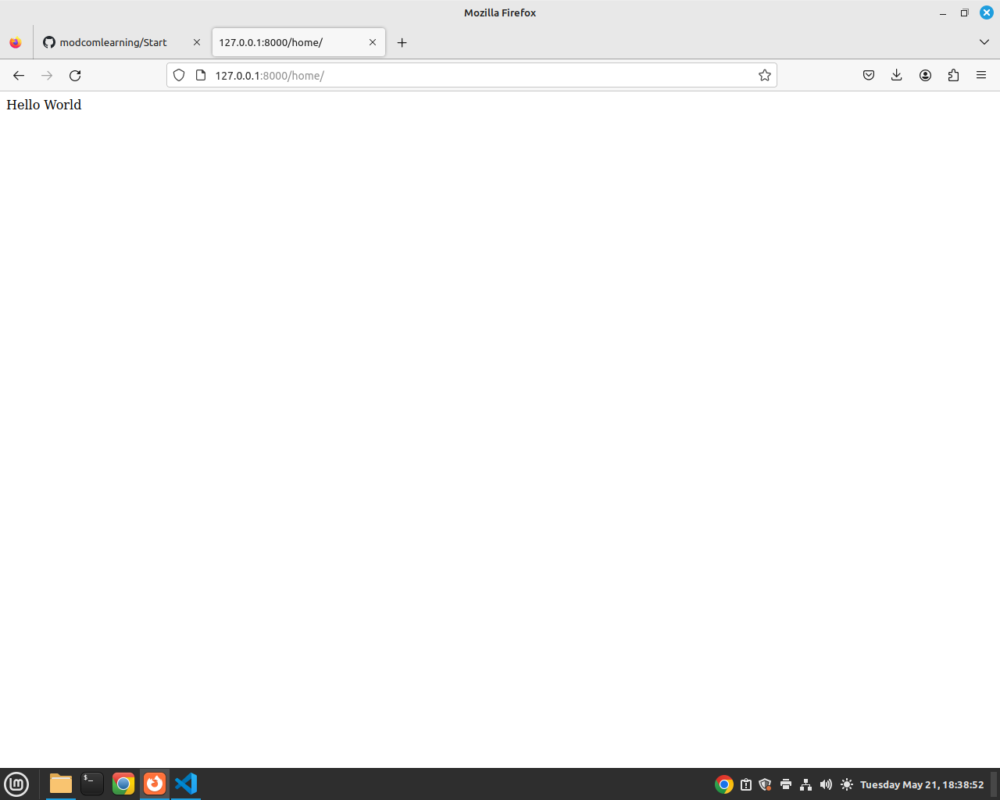
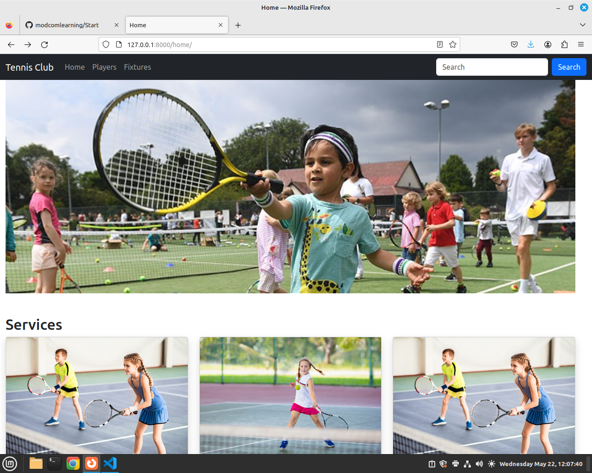
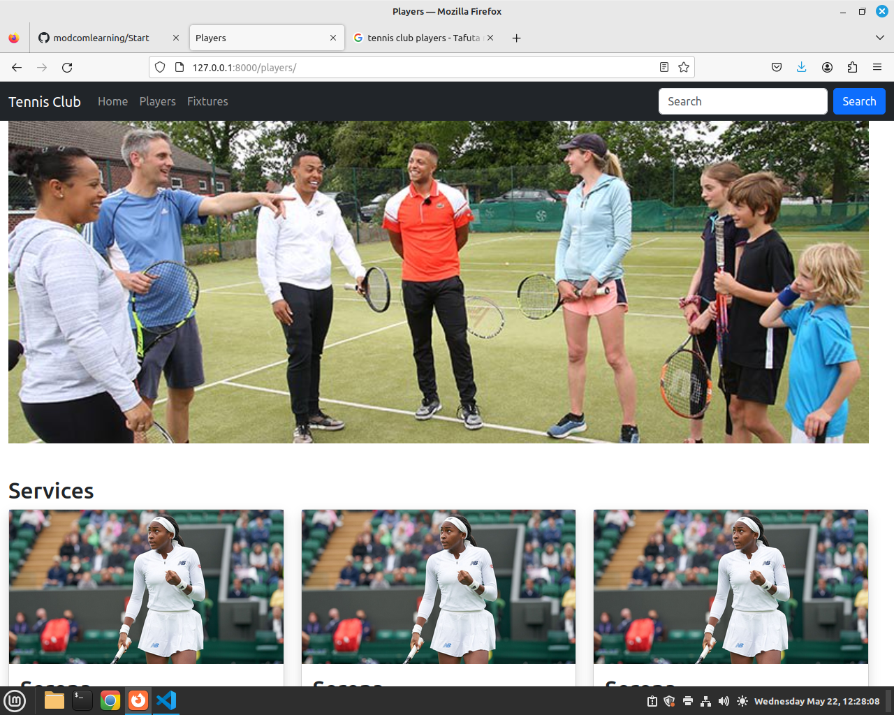

##  Python Django Program
### What is Django?

Django is a Python framework that makes it easier to create web sites using Python.
<br>
Django takes care of the difficult stuff so that you can concentrate on building your web applications.
<br>
Django emphasizes reusability of components, also referred to as DRY (Don't Repeat Yourself), and comes with ready-to-use features like login system, database connection and CRUD operations (Create Read Update Delete).

### How does Django Work?

#### Django follows the MVT design pattern (Model View Template).

Model - The data you want to present, usually data from a database. 
<br> <br>
View - A request handler that returns the relevant template and content - based on the request from the user.
<br> <br>
Template - A text file (like an HTML file) containing the layout of the web page, with logic on how to display the data.
<br> <br>

## Creating a Website in Django
In this Section, we will create a Django based website named 'my tennis club'. Its a website for a Tenis Club.
<br><br>

#### Install Django in Linux
To install django type below command in Terminal<br>
```python -m pip install Django```

#### Check Installed Django version
To check django version type below command in Terminal<br>
```django-admin --version```


### Creating a New Project.
In VS Code Terminal navigate to your desktop. Type below command <br>
``` django-admin startproject my_tennis_club``` 

Above command creates a New Project.

<br>
Run your Project.
In Terminal hange Directory to my_tennis_club folder type below command to run your app <br>

``` python3 manage.py runserver ```

<br><br>
Open a new browser window and type 127.0.0.1:8000 in the address bar.



### What's Next?
We have a Django project! <br>
The next step is to make an app in your project. <br>
You cannot have a web page created with Django without an app.<br>
<br><br>
Start by navigating to the selected location where you want to store the app, in my case the my_tennis_club folder, and run the command below.<br>

```py manage.py startapp members ```

Django creates a folder named members in my project, with this content: <br>
Please Note we have two folders <br>1. A Folder named members - this is the App Folder with files inside<br>2. my tenis club folder, this is a Folder for the whole Project with Files inside.
<br> See below screenshot.



### Explanation
    __init__.py − Just to make sure python handles this folder as a package.

    admin.py − This file helps you make the app modifiable in the admin interface.

    models.py − This is where all the application models are stored.

    tests.py − This is where your unit tests are.

    views.py − This is where your application views are.


### Views

Django views are Python functions that takes http requests and returns http response, like HTML documents.<br>

A web page that uses Django is full of views with different tasks and missions.<br>

Views are usually put in a file called views.py located on your app's folder.<br>

There is a views.py in your members folder that looks like this:<br>
my_tennis_club/members/views.py:
```
        from django.shortcuts import render

        # Create your views here.
```
<br><br>
Update your views.py to look like below
Here we create a Function Home(a View) that returns a Hello World response. <br>

        from django.shortcuts import render
        from django.http import HttpResponse

        def home(request):
            return HttpResponse("Hello World")


<br> <br>
This is a simple example on how to send a response back to the browser.

But how can we execute the view? Well, we must call the view via a URL. <br>

## URLs
Create a file named urls.py in the same folder as the views.py file, and type this code in it:

In this File add below code, This code adds a Path to your home view you created in views.py <br>

        from django.urls import path
        from . import views

        urlpatterns = [
            path('home/', views.home, name='home'),

        ]

Before, we run our app.  The urls.py file you just created is specific for the members application.
We have to do some routing in the root directory my_tennis_club as well. <br>

There is a file called urls.py on the my_tennis_club folder, open that file and add the include module in the import statement, and also add a path() function in the urlpatterns[] list, with arguments that will route users that comes in via [127.0.0.1:8000/].

Then your file will look like this:

    from django.contrib import admin
    from django.urls import path, include

    urlpatterns = [
        path('', include('members.urls')),
        path('admin/', admin.site.urls),
    ]


If the server is not running, In VS Code terminal, navigate to the /my_tennis_club folder and execute this command<br>
``` python3 manage.py runserver ```


In the browser window, type 127.0.0.1:8000/home/ in the address bar.

below is the output.



## Templates
In Django the result is mostly presented in the browser, In order to create web pages use HTML and CSS. <br>

In this section we learn how to create HTML templates in django. <br>

Create a <b>templates</b> folder inside the <b>members</b> folder, and create a HTML file named 
<b>navbar.html</b>

In navbar.html place below navbar code.

        <nav class="navbar navbar-expand-sm navbar-dark bg-dark">
            <div class="container-fluid">
            <a class="navbar-brand" href="javascript:void(0)">Logo</a>
            <button class="navbar-toggler" type="button" data-bs-toggle="collapse" data-bs-target="#mynavbar">
                <span class="navbar-toggler-icon"></span>
            </button>
            <div class="collapse navbar-collapse" id="mynavbar">
                <ul class="navbar-nav me-auto">
                <li class="nav-item">
                    <a class="nav-link" href="/home">Home</a>
                </li>
                <li class="nav-item">
                    <a class="nav-link" href="/players">Players</a>
                </li>
                <li class="nav-item">
                    <a class="nav-link" href="/fixtures">Fixtures</a>
                </li>
                </ul>
                <form class="d-flex">
                <input class="form-control me-2" type="text" placeholder="Search">
                <button class="btn btn-primary" type="button">Search</button>
                </form>
            </div>
            </div>
        </nav> 


Create another HTML file named home.html and place below code inside.
Below code creates a basic home page and includes a navbar.

```
    <!DOCTYPE html>
    <html lang="en">
    <head>
        <meta charset="UTF-8">
        <meta name="viewport" content="width=device-width, initial-scale=1.0">
        <link href="https://cdn.jsdelivr.net/npm/bootstrap@5.3.3/dist/css/bootstrap.min.css" rel="stylesheet" integrity="sha384-QWTKZyjpPEjISv5WaRU9OFeRpok6YctnYmDr5pNlyT2bRjXh0JMhjY6hW+ALEwIH" crossorigin="anonymous">
        <script src="https://cdn.jsdelivr.net/npm/bootstrap@5.3.3/dist/js/bootstrap.bundle.min.js" integrity="sha384-YvpcrYf0tY3lHB60NNkmXc5s9fDVZLESaAA55NDzOxhy9GkcIdslK1eN7N6jIeHz" crossorigin="anonymous"></script>
        <title>Home</title>
    </head>
    <body>
        
        <!-- Include Navbar -->
        

        <section class="row">
            <h1>My Tenis Club</h1>
        </section>
    </body>
    </html>
```


Next we need to call this home.html template in views.py, we modify views.py, home function to return the home.htm template.<br>

Update your views.py to look like belo code.

        from django.shortcuts import render
        from django.http import HttpResponse
        from django.template import loader
        # Create your views here.
        def home(request):
            template = loader.get_template('home.html')
            return HttpResponse(template.render())
            #return HttpResponse("Hello World")


When we run the home route it will use the loader to get_template() and return the home.html as the response on the browser.

Before we run the project check members/urls.py and confirm if home view is set to path.
We can confirm the home view is put to path and can be accessed through 127.0.0.1:8000/home   <br>
    from django.urls import path
    from . import views

    urlpatterns = [
        path('home/', views.home, name='home'),
    ]

## Change Settings

To be able to work with more advanced application other than "Hello World!", We have to tell Django that a new app is created.
<br>
This is done in the settings.py file in the my_tennis_club folder.
<br>
Look up the INSTALLED_APPS[] list and add the members app like this:
<br>

Add members in the installed apps. see below

# Application definition

    INSTALLED_APPS = [
        'django.contrib.admin',
        'django.contrib.auth',
        'django.contrib.contenttypes',
        'django.contrib.sessions',
        'django.contrib.messages',
        'django.contrib.staticfiles',
        'members'
    ]

Run your Project and access 127.0.0.1:8000/home

## Static Images in Django
In your members app folder, create a Folder named static and place your images inside static Folder you created.

In settings.py add this Line
```
 STATIC_URL = "static/"
```


Then in your home.html, you will load images using below code. Here we access a n image named kids.jpg located in static folder. <br>
```
 

```


Lets Update our home.html template to look like below. <br>
```
 <!DOCTYPE html>
<html lang="en">
<head>
    <meta charset="UTF-8">
    <meta name="viewport" content="width=device-width, initial-scale=1.0">
    <link href="https://cdn.jsdelivr.net/npm/bootstrap@5.3.3/dist/css/bootstrap.min.css" rel="stylesheet" integrity="sha384-QWTKZyjpPEjISv5WaRU9OFeRpok6YctnYmDr5pNlyT2bRjXh0JMhjY6hW+ALEwIH" crossorigin="anonymous">
    <script src="https://cdn.jsdelivr.net/npm/bootstrap@5.3.3/dist/js/bootstrap.bundle.min.js" integrity="sha384-YvpcrYf0tY3lHB60NNkmXc5s9fDVZLESaAA55NDzOxhy9GkcIdslK1eN7N6jIeHz" crossorigin="anonymous"></script>
    <title>Home</title>
</head>
<body>
    
    <!-- Include Navbar -->
    

    <section class="row container-fluid">
        <h1>My Tennis Club</h1>
        <div class="col-md-12">
            
            
        </div>
    </section>
    <br><br>
    <section class="row container-fluid">
        <h2>Services</h2>
         <div class="col-md-4">
              <div class="card shadow">
                
                
                <div class="card-body">
                      <h2>Kids Classes</h2>
                      <p>Lorem ipsum dolor sit amet, consectetur adipisicing elit. Nesciunt totam magni neque! At accusantium quibusdam, nemo delectus impedit atque aperiam! Enim labore quis voluptates optio aliquam repellendus amet aut minus.</p>
                </div>
              </div>
         </div>

         <div class="col-md-4">
            <div class="card shadow">
                
                
                <div class="card-body">
                      <h2>Kids Practice</h2>
                      <p>Lorem ipsum dolor sit amet, consectetur adipisicing elit. Nesciunt totam magni neque! At accusantium quibusdam, nemo delectus impedit atque aperiam! Enim labore quis voluptates optio aliquam repellendus amet aut minus.</p>
                </div>
              </div>
         </div>

         <div class="col-md-4">
            <div class="card shadow">
                
                
                <div class="card-body">
                      <h2>Free Classes</h2>
                      <p>Lorem ipsum dolor sit amet, consectetur adipisicing elit. Nesciunt totam magni neque! At accusantium quibusdam, nemo delectus impedit atque aperiam! Enim labore quis voluptates optio aliquam repellendus amet aut minus.</p>
                </div>
              </div>
         </div>
    </section>


    <br><br>
    
    <section class="row container-fluid">
        <h2>Packages</h2>
         <div class="col-md-4">
              <div class="card shadow">
                
                
                <div class="card-body">
                      <h2>Gold</h2>
                      <p>Lorem ipsum dolor sit amet, consectetur adipisicing elit. Nesciunt totam magni neque! At accusantium quibusdam, nemo delectus impedit atque aperiam! Enim labore quis voluptates optio aliquam repellendus amet aut minus.</p>
                </div>
              </div>
         </div>

         <div class="col-md-4">
            <div class="card shadow">
                
                
                <div class="card-body">
                      <h2>Silver</h2>
                      <p>Lorem ipsum dolor sit amet, consectetur adipisicing elit. Nesciunt totam magni neque! At accusantium quibusdam, nemo delectus impedit atque aperiam! Enim labore quis voluptates optio aliquam repellendus amet aut minus.</p>
                </div>
              </div>
         </div>

         <div class="col-md-4">
            <div class="card shadow">
                
                
                <div class="card-body">
                      <h2>Bronze</h2>
                      <p>Lorem ipsum dolor sit amet, consectetur adipisicing elit. Nesciunt totam magni neque! At accusantium quibusdam, nemo delectus impedit atque aperiam! Enim labore quis voluptates optio aliquam repellendus amet aut minus.</p>
                </div>
              </div>
         </div>
    </section>

    <br><br>
    <section class="row">
         <div class="col-md-12 bg-dark">
                <b class="text-white">Developed by MODCOM</b>
         </div>
    </section>
</body>
</html>
```

Output


## Creating another View and Template.
In this section, we create another template named players.html and connect it to a view in views.py
In templates folder create a file named players.html

Write below code in players.html
```
<!DOCTYPE html>
<html lang="en">
<head>
    <meta charset="UTF-8">
    <meta name="viewport" content="width=device-width, initial-scale=1.0">
    <title>Players</title>
</head>
<body>
      <!-- Include Navbar -->
    
    <section class="row container-fluid">
        <div class="col-md-12">
            
            
        </div>
    </section>

</body>
</html>

```

 In views.py add below View Function named players that returns a HTML template.
```
 def players(request):
    template = loader.get_template('players.html')
    return HttpResponse(template.render())
   
```


Your complete views.py look like below code snippet.
```
from django.shortcuts import render
from django.http import HttpResponse
from django.template import loader


# Create your views here.
# Home View
def home(request):
    template = loader.get_template('home.html')
    return HttpResponse(template.render())
    #return HttpResponse("Hello World")


# Players View
def players(request):
    template = loader.get_template('players.html')
    return HttpResponse(template.render())
    #return HttpResponse("Hello World")

```

In members Folder, Open urls.py and put the path to players view.
```
from django.urls import path
from . import views

urlpatterns = [
    path('home/', views.home, name='home'),
    path('players/', views.players, name='players'),
]
```


Run your project and access http://127.0.0.1:8000/players/


Update your players.html with below code.

```
<!DOCTYPE html>
<html lang="en">
<head>
    <meta charset="UTF-8">
    <meta name="viewport" content="width=device-width, initial-scale=1.0">
    <link href="https://cdn.jsdelivr.net/npm/bootstrap@5.3.3/dist/css/bootstrap.min.css" rel="stylesheet" integrity="sha384-QWTKZyjpPEjISv5WaRU9OFeRpok6YctnYmDr5pNlyT2bRjXh0JMhjY6hW+ALEwIH" crossorigin="anonymous">
    <script src="https://cdn.jsdelivr.net/npm/bootstrap@5.3.3/dist/js/bootstrap.bundle.min.js" integrity="sha384-YvpcrYf0tY3lHB60NNkmXc5s9fDVZLESaAA55NDzOxhy9GkcIdslK1eN7N6jIeHz" crossorigin="anonymous"></script>
    <title>Players</title>
</head>
<body>
      <!-- Include Navbar -->
    
    <section class="row container-fluid">
        <div class="col-md-12">
            
            
        </div>
    </section>


    <br><br>
    <section class="row container-fluid">
        <h2>Services</h2>
         <div class="col-md-4">
              <div class="card shadow">
                
                
                <div class="card-body">
                      <h2>Serena</h2>
                      <p>Lorem ipsum dolor sit amet, consectetur adipisicing elit. Nesciunt totam magni neque! At accusantium quibusdam, nemo delectus impedit atque aperiam! Enim labore quis voluptates optio aliquam repellendus amet aut minus.</p>
                </div>
              </div>
         </div>

         <div class="col-md-4">
            <div class="card shadow">
                
                
                <div class="card-body">
                      <h2>Serena</h2>
                      <p>Lorem ipsum dolor sit amet, consectetur adipisicing elit. Nesciunt totam magni neque! At accusantium quibusdam, nemo delectus impedit atque aperiam! Enim labore quis voluptates optio aliquam repellendus amet aut minus.</p>
                </div>
              </div>
         </div>

         <div class="col-md-4">
            <div class="card shadow">
                
                
                <div class="card-body">
                      <h2>Serena</h2>
                      <p>Lorem ipsum dolor sit amet, consectetur adipisicing elit. Nesciunt totam magni neque! At accusantium quibusdam, nemo delectus impedit atque aperiam! Enim labore quis voluptates optio aliquam repellendus amet aut minus.</p>
                </div>
              </div>
         </div>
    </section>


    <br><br>
    <section class="row container-fluid">
        <h2>Services</h2>
         <div class="col-md-4">
              <div class="card shadow">
                
                
                <div class="card-body">
                      <h2>Serena</h2>
                      <p>Lorem ipsum dolor sit amet, consectetur adipisicing elit. Nesciunt totam magni neque! At accusantium quibusdam, nemo delectus impedit atque aperiam! Enim labore quis voluptates optio aliquam repellendus amet aut minus.</p>
                </div>
              </div>
         </div>

         <div class="col-md-4">
            <div class="card shadow">
                
                
                <div class="card-body">
                      <h2>Serena</h2>
                      <p>Lorem ipsum dolor sit amet, consectetur adipisicing elit. Nesciunt totam magni neque! At accusantium quibusdam, nemo delectus impedit atque aperiam! Enim labore quis voluptates optio aliquam repellendus amet aut minus.</p>
                </div>
              </div>
         </div>

         <div class="col-md-4">
            <div class="card shadow">
                
                
                <div class="card-body">
                      <h2>Serena</h2>
                      <p>Lorem ipsum dolor sit amet, consectetur adipisicing elit. Nesciunt totam magni neque! At accusantium quibusdam, nemo delectus impedit atque aperiam! Enim labore quis voluptates optio aliquam repellendus amet aut minus.</p>
                </div>
              </div>
         </div>
    </section>

    <br><br>
    <section class="row">
         <div class="col-md-12 bg-dark">
                <b class="text-white">Developed by MODCOM</b>
         </div>
    </section>

</body>
</html>
```


In the navbar update the Links to link to respective urls 

Updated navbar
```
<nav class="navbar navbar-expand-sm navbar-dark bg-dark">
    <div class="container-fluid">
      <a class="navbar-brand" href="javascript:void(0)">Tennis Club</a>
      <button class="navbar-toggler" type="button" data-bs-toggle="collapse" data-bs-target="#mynavbar">
        <span class="navbar-toggler-icon"></span>
      </button>
      <div class="collapse navbar-collapse" id="mynavbar">
        <ul class="navbar-nav me-auto">
          <li class="nav-item">
            <a class="nav-link" href="/home">Home</a>
          </li>
          <li class="nav-item">
            <a class="nav-link" href="/players">Players</a>
          </li>
          <li class="nav-item">
            <a class="nav-link" href="/fixtures">Fixtures</a>
          </li>
        </ul>
        <form class="d-flex">
          <input class="form-control me-2" type="text" placeholder="Search">
          <button class="btn btn-primary" type="button">Search</button>
        </form>
      </div>
    </div>
  </nav> 

```

Run your project and access http://127.0.0.1:8000/home/
Your navbar should navigate to players route.



Assignment.
TODO Fixtures and Gallery.


