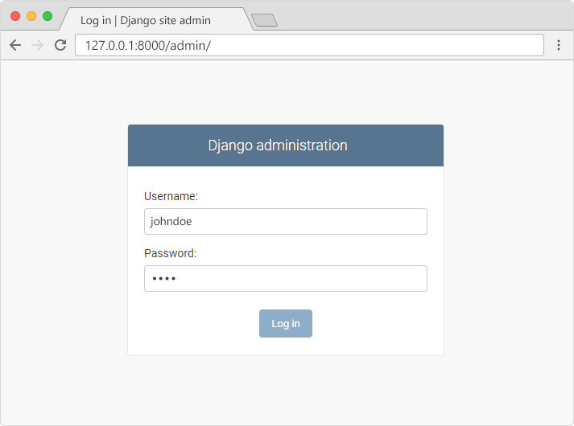
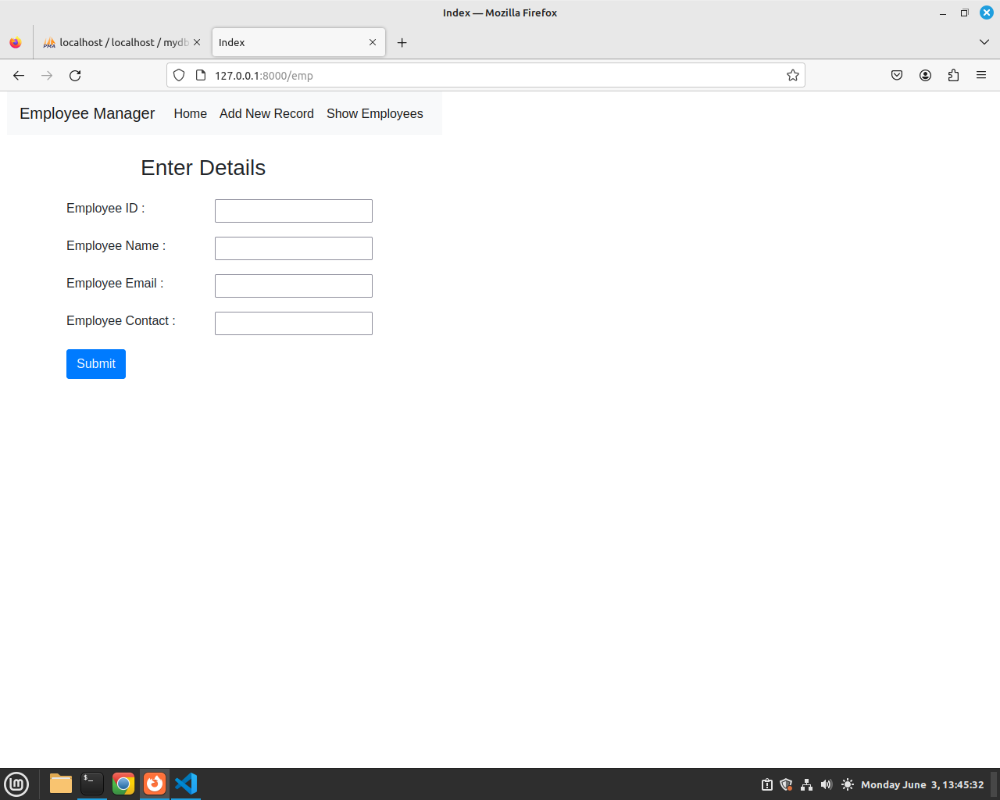
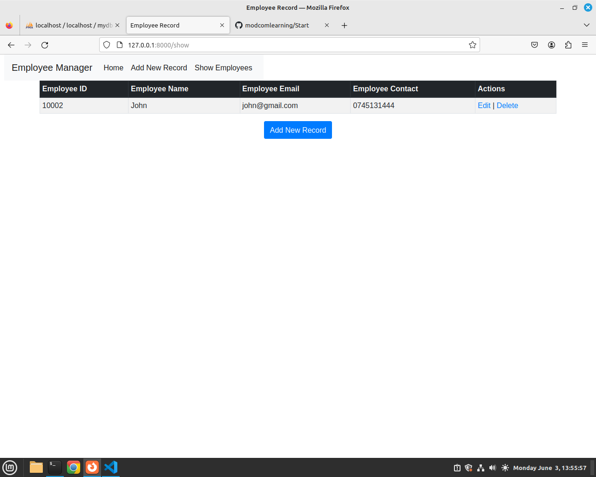
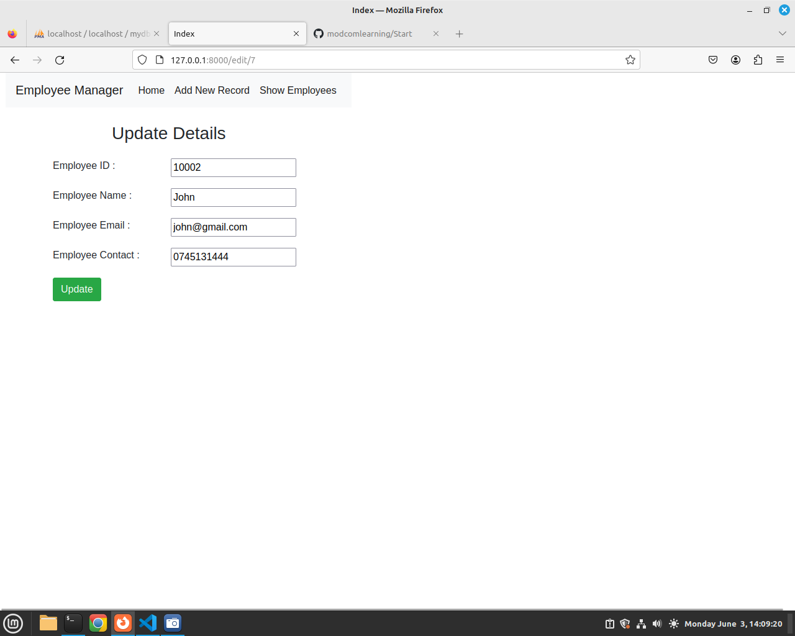

##  Python Django Program
### What is Django?

Django is a Python framework that makes it easier to create web sites using Python.
<br>
Django takes care of the difficult stuff so that you can concentrate on building your web applications.
<br>
Django emphasizes reusability of components, also referred to as DRY (Don't Repeat Yourself), and comes with ready-to-use features like login system, database connection and CRUD operations (Create Read Update Delete).

### How does Django Work?

#### Django follows the MVT design pattern (Model View Template).

Model - The data you want to present, usually data from a database. 
<br> <br>
View - A request handler that returns the relevant template and content - based on the request from the user.
<br> <br>
Template - A text file (like an HTML file) containing the layout of the web page, with logic on how to display the data.
<br> <br>

### Part1
#### Creating a Website in Django
In this Section, we will create a Django based website named 'my tennis club'. Its a website for a Tenis Club.
<br><br>

#### Install Django in Linux
To install django type below command in Terminal<br>
```python -m pip install Django```

#### Check Installed Django version
To check django version type below command in Terminal<br>
```django-admin --version```


### Creating a New Project.
In VS Code Terminal navigate to your desktop. Type below command <br>
``` django-admin startproject my_tennis_club``` 

Above command creates a New Project.

<br>
Run your Project.
In Terminal hange Directory to my_tennis_club folder type below command to run your app <br>

``` python3 manage.py runserver ```

<br><br>
Open a new browser window and type 127.0.0.1:8000 in the address bar.


### What's Next?
We have a Django project! <br>
The next step is to make an app in your project. <br>
You cannot have a web page created with Django without an app.<br>
<br><br>
Start by navigating to the selected location where you want to store the app, in my case the my_tennis_club folder, and run the command below.<br>

```py manage.py startapp members ```

Django creates a folder named members in my project, with this content: <br>
Please Note we have two folders <br>1. A Folder named members - this is the App Folder with files inside<br>2. my tenis club folder, this is a Folder for the whole Project with Files inside.
<br> See below screenshot.


### Explanation
    __init__.py − Just to make sure python handles this folder as a package.

    admin.py − This file helps you make the app modifiable in the admin interface.

    models.py − This is where all the application models are stored.

    tests.py − This is where your unit tests are.

    views.py − This is where your application views are.


### Views

Django views are Python functions that takes http requests and returns http response, like HTML documents.<br>

A web page that uses Django is full of views with different tasks and missions.<br>

Views are usually put in a file called views.py located on your app's folder.<br>

There is a views.py in your members folder that looks like this:<br>
my_tennis_club/members/views.py:
```
        from django.shortcuts import render

        # Create your views here.
```
<br><br>
Update your views.py to look like below
Here we create a Function Home(a View) that returns a Hello World response. <br>

        from django.shortcuts import render
        from django.http import HttpResponse

        def home(request):
            return HttpResponse("Hello World")


<br> <br>
This is a simple example on how to send a response back to the browser.

But how can we execute the view? Well, we must call the view via a URL. <br>

## URLs
Create a file named urls.py in the same folder as the views.py file, and type this code in it:

In this File add below code, This code adds a Path to your home view you created in views.py <br>

        from django.urls import path
        from . import views

        urlpatterns = [
            path('home/', views.home, name='home'),

        ]

Before, we run our app.  The urls.py file you just created is specific for the members application.
We have to do some routing in the root directory my_tennis_club as well. <br>

There is a file called urls.py on the my_tennis_club folder, open that file and add the include module in the import statement, and also add a path() function in the urlpatterns[] list, with arguments that will route users that comes in via [127.0.0.1:8000/].

Then your file will look like this:

    from django.contrib import admin
    from django.urls import path, include

    urlpatterns = [
        path('', include('members.urls')),
        path('admin/', admin.site.urls),
    ]


If the server is not running, In VS Code terminal, navigate to the /my_tennis_club folder and execute this command<br>
``` python3 manage.py runserver ```


In the browser window, type 127.0.0.1:8000/home/ in the address bar.

below is the output.


## Templates
In Django the result is mostly presented in the browser, In order to create web pages use HTML and CSS. <br>

In this section we learn how to create HTML templates in django. <br>

Create a <b>templates</b> folder inside the <b>members</b> folder, and create a HTML file named 
<b>navbar.html</b>

In navbar.html place below navbar code.

        <nav class="navbar navbar-expand-sm navbar-dark bg-dark">
            <div class="container-fluid">
            <a class="navbar-brand" href="javascript:void(0)">Logo</a>
            <button class="navbar-toggler" type="button" data-bs-toggle="collapse" data-bs-target="#mynavbar">
                <span class="navbar-toggler-icon"></span>
            </button>
            <div class="collapse navbar-collapse" id="mynavbar">
                <ul class="navbar-nav me-auto">
                <li class="nav-item">
                    <a class="nav-link" href="/home">Home</a>
                </li>
                <li class="nav-item">
                    <a class="nav-link" href="/players">Players</a>
                </li>
                <li class="nav-item">
                    <a class="nav-link" href="/fixtures">Fixtures</a>
                </li>
                </ul>
                <form class="d-flex">
                <input class="form-control me-2" type="text" placeholder="Search">
                <button class="btn btn-primary" type="button">Search</button>
                </form>
            </div>
            </div>
        </nav> 


Create another HTML file named home.html and place below code inside.
Below code creates a basic home page and includes a navbar.

```
    <!DOCTYPE html>
    <html lang="en">
    <head>
        <meta charset="UTF-8">
        <meta name="viewport" content="width=device-width, initial-scale=1.0">
        <link href="https://cdn.jsdelivr.net/npm/bootstrap@5.3.3/dist/css/bootstrap.min.css" rel="stylesheet" integrity="sha384-QWTKZyjpPEjISv5WaRU9OFeRpok6YctnYmDr5pNlyT2bRjXh0JMhjY6hW+ALEwIH" crossorigin="anonymous">
        <script src="https://cdn.jsdelivr.net/npm/bootstrap@5.3.3/dist/js/bootstrap.bundle.min.js" integrity="sha384-YvpcrYf0tY3lHB60NNkmXc5s9fDVZLESaAA55NDzOxhy9GkcIdslK1eN7N6jIeHz" crossorigin="anonymous"></script>
        <title>Home</title>
    </head>
    <body>
        
        <!-- Include Navbar -->
        

        <section class="row">
            <h1>My Tenis Club</h1>
        </section>
    </body>
    </html>
```


Next we need to call this home.html template in views.py, we modify views.py, home function to return the home.htm template.<br>

Update your views.py to look like belo code.

        from django.shortcuts import render
        from django.http import HttpResponse
        from django.template import loader
        # Create your views here.
        def home(request):
            template = loader.get_template('home.html')
            return HttpResponse(template.render())
            #return HttpResponse("Hello World")


When we run the home route it will use the loader to get_template() and return the home.html as the response on the browser.

Before we run the project check members/urls.py and confirm if home view is set to path.
We can confirm the home view is put to path and can be accessed through 127.0.0.1:8000/home   <br>
    from django.urls import path
    from . import views

    urlpatterns = [
        path('home/', views.home, name='home'),
    ]

## Change Settings

To be able to work with more advanced application other than "Hello World!", We have to tell Django that a new app is created.
<br>
This is done in the settings.py file in the my_tennis_club folder.
<br>
Look up the INSTALLED_APPS[] list and add the members app like this:
<br>

Add members in the installed apps. see below

# Application definition

    INSTALLED_APPS = [
        'django.contrib.admin',
        'django.contrib.auth',
        'django.contrib.contenttypes',
        'django.contrib.sessions',
        'django.contrib.messages',
        'django.contrib.staticfiles',
        'members'
    ]

Run your Project and access 127.0.0.1:8000/home

## Static Images in Django
In your members app folder, create a Folder named static and place your images inside static Folder you created.

In settings.py add this Line
```
 STATIC_URL = "static/"
```


Then in your home.html, you will load images using below code. Here we access a n image named kids.jpg located in static folder. <br>
```
 

```


Lets Update our home.html template to look like below. <br>
```
 <!DOCTYPE html>
<html lang="en">
<head>
    <meta charset="UTF-8">
    <meta name="viewport" content="width=device-width, initial-scale=1.0">
    <link href="https://cdn.jsdelivr.net/npm/bootstrap@5.3.3/dist/css/bootstrap.min.css" rel="stylesheet" integrity="sha384-QWTKZyjpPEjISv5WaRU9OFeRpok6YctnYmDr5pNlyT2bRjXh0JMhjY6hW+ALEwIH" crossorigin="anonymous">
    <script src="https://cdn.jsdelivr.net/npm/bootstrap@5.3.3/dist/js/bootstrap.bundle.min.js" integrity="sha384-YvpcrYf0tY3lHB60NNkmXc5s9fDVZLESaAA55NDzOxhy9GkcIdslK1eN7N6jIeHz" crossorigin="anonymous"></script>
    <title>Home</title>
</head>
<body>
    
    <!-- Include Navbar -->
    

    <section class="row container-fluid">
        <h1>My Tennis Club</h1>
        <div class="col-md-12">
            
            
        </div>
    </section>
    <br><br>
    <section class="row container-fluid">
        <h2>Services</h2>
         <div class="col-md-4">
              <div class="card shadow">
                
                
                <div class="card-body">
                      <h2>Kids Classes</h2>
                      <p>Lorem ipsum dolor sit amet, consectetur adipisicing elit. Nesciunt totam magni neque! At accusantium quibusdam, nemo delectus impedit atque aperiam! Enim labore quis voluptates optio aliquam repellendus amet aut minus.</p>
                </div>
              </div>
         </div>

         <div class="col-md-4">
            <div class="card shadow">
                
                
                <div class="card-body">
                      <h2>Kids Practice</h2>
                      <p>Lorem ipsum dolor sit amet, consectetur adipisicing elit. Nesciunt totam magni neque! At accusantium quibusdam, nemo delectus impedit atque aperiam! Enim labore quis voluptates optio aliquam repellendus amet aut minus.</p>
                </div>
              </div>
         </div>

         <div class="col-md-4">
            <div class="card shadow">
                
                
                <div class="card-body">
                      <h2>Free Classes</h2>
                      <p>Lorem ipsum dolor sit amet, consectetur adipisicing elit. Nesciunt totam magni neque! At accusantium quibusdam, nemo delectus impedit atque aperiam! Enim labore quis voluptates optio aliquam repellendus amet aut minus.</p>
                </div>
              </div>
         </div>
    </section>


    <br><br>
    
    <section class="row container-fluid">
        <h2>Packages</h2>
         <div class="col-md-4">
              <div class="card shadow">
                
                
                <div class="card-body">
                      <h2>Gold</h2>
                      <p>Lorem ipsum dolor sit amet, consectetur adipisicing elit. Nesciunt totam magni neque! At accusantium quibusdam, nemo delectus impedit atque aperiam! Enim labore quis voluptates optio aliquam repellendus amet aut minus.</p>
                </div>
              </div>
         </div>

         <div class="col-md-4">
            <div class="card shadow">
                
                
                <div class="card-body">
                      <h2>Silver</h2>
                      <p>Lorem ipsum dolor sit amet, consectetur adipisicing elit. Nesciunt totam magni neque! At accusantium quibusdam, nemo delectus impedit atque aperiam! Enim labore quis voluptates optio aliquam repellendus amet aut minus.</p>
                </div>
              </div>
         </div>

         <div class="col-md-4">
            <div class="card shadow">
                
                
                <div class="card-body">
                      <h2>Bronze</h2>
                      <p>Lorem ipsum dolor sit amet, consectetur adipisicing elit. Nesciunt totam magni neque! At accusantium quibusdam, nemo delectus impedit atque aperiam! Enim labore quis voluptates optio aliquam repellendus amet aut minus.</p>
                </div>
              </div>
         </div>
    </section>

    <br><br>
    <section class="row">
         <div class="col-md-12 bg-dark">
                <b class="text-white">Developed by MODCOM</b>
         </div>
    </section>
</body>
</html>
```

Output


## Creating another View and Template.
In this section, we create another template named players.html and connect it to a view in views.py
In templates folder create a file named players.html

Write below code in players.html
```
<!DOCTYPE html>
<html lang="en">
<head>
    <meta charset="UTF-8">
    <meta name="viewport" content="width=device-width, initial-scale=1.0">
    <title>Players</title>
</head>
<body>
      <!-- Include Navbar -->
    
    <section class="row container-fluid">
        <div class="col-md-12">
            
            
        </div>
    </section>

</body>
</html>

```

 In views.py add below View Function named players that returns a HTML template.
```
 def players(request):
    template = loader.get_template('players.html')
    return HttpResponse(template.render())
   
```


Your complete views.py look like below code snippet.
```
from django.shortcuts import render
from django.http import HttpResponse
from django.template import loader


# Create your views here.
# Home View
def home(request):
    template = loader.get_template('home.html')
    return HttpResponse(template.render())
    #return HttpResponse("Hello World")


# Players View
def players(request):
    template = loader.get_template('players.html')
    return HttpResponse(template.render())
    #return HttpResponse("Hello World")

```

In members Folder, Open urls.py and put the path to players view.
```
from django.urls import path
from . import views

urlpatterns = [
    path('home/', views.home, name='home'),
    path('players/', views.players, name='players'),
]
```


Run your project and access http://127.0.0.1:8000/players/


Update your players.html with below code.

```
<!DOCTYPE html>
<html lang="en">
<head>
    <meta charset="UTF-8">
    <meta name="viewport" content="width=device-width, initial-scale=1.0">
    <link href="https://cdn.jsdelivr.net/npm/bootstrap@5.3.3/dist/css/bootstrap.min.css" rel="stylesheet" integrity="sha384-QWTKZyjpPEjISv5WaRU9OFeRpok6YctnYmDr5pNlyT2bRjXh0JMhjY6hW+ALEwIH" crossorigin="anonymous">
    <script src="https://cdn.jsdelivr.net/npm/bootstrap@5.3.3/dist/js/bootstrap.bundle.min.js" integrity="sha384-YvpcrYf0tY3lHB60NNkmXc5s9fDVZLESaAA55NDzOxhy9GkcIdslK1eN7N6jIeHz" crossorigin="anonymous"></script>
    <title>Players</title>
</head>
<body>
      <!-- Include Navbar -->
    
    <section class="row container-fluid">
        <div class="col-md-12">
            
            
        </div>
    </section>


    <br><br>
    <section class="row container-fluid">
        <h2>Services</h2>
         <div class="col-md-4">
              <div class="card shadow">
                
                
                <div class="card-body">
                      <h2>Serena</h2>
                      <p>Lorem ipsum dolor sit amet, consectetur adipisicing elit. Nesciunt totam magni neque! At accusantium quibusdam, nemo delectus impedit atque aperiam! Enim labore quis voluptates optio aliquam repellendus amet aut minus.</p>
                </div>
              </div>
         </div>

         <div class="col-md-4">
            <div class="card shadow">
                
                
                <div class="card-body">
                      <h2>Serena</h2>
                      <p>Lorem ipsum dolor sit amet, consectetur adipisicing elit. Nesciunt totam magni neque! At accusantium quibusdam, nemo delectus impedit atque aperiam! Enim labore quis voluptates optio aliquam repellendus amet aut minus.</p>
                </div>
              </div>
         </div>

         <div class="col-md-4">
            <div class="card shadow">
                
                
                <div class="card-body">
                      <h2>Serena</h2>
                      <p>Lorem ipsum dolor sit amet, consectetur adipisicing elit. Nesciunt totam magni neque! At accusantium quibusdam, nemo delectus impedit atque aperiam! Enim labore quis voluptates optio aliquam repellendus amet aut minus.</p>
                </div>
              </div>
         </div>
    </section>


    <br><br>
    <section class="row container-fluid">
        <h2>Services</h2>
         <div class="col-md-4">
              <div class="card shadow">
                
                
                <div class="card-body">
                      <h2>Serena</h2>
                      <p>Lorem ipsum dolor sit amet, consectetur adipisicing elit. Nesciunt totam magni neque! At accusantium quibusdam, nemo delectus impedit atque aperiam! Enim labore quis voluptates optio aliquam repellendus amet aut minus.</p>
                </div>
              </div>
         </div>

         <div class="col-md-4">
            <div class="card shadow">
                
                
                <div class="card-body">
                      <h2>Serena</h2>
                      <p>Lorem ipsum dolor sit amet, consectetur adipisicing elit. Nesciunt totam magni neque! At accusantium quibusdam, nemo delectus impedit atque aperiam! Enim labore quis voluptates optio aliquam repellendus amet aut minus.</p>
                </div>
              </div>
         </div>

         <div class="col-md-4">
            <div class="card shadow">
                
                
                <div class="card-body">
                      <h2>Serena</h2>
                      <p>Lorem ipsum dolor sit amet, consectetur adipisicing elit. Nesciunt totam magni neque! At accusantium quibusdam, nemo delectus impedit atque aperiam! Enim labore quis voluptates optio aliquam repellendus amet aut minus.</p>
                </div>
              </div>
         </div>
    </section>

    <br><br>
    <section class="row">
         <div class="col-md-12 bg-dark">
                <b class="text-white">Developed by MODCOM</b>
         </div>
    </section>

</body>
</html>
```


In the navbar update the Links to link to respective urls 

Updated navbar
```
<nav class="navbar navbar-expand-sm navbar-dark bg-dark">
    <div class="container-fluid">
      <a class="navbar-brand" href="javascript:void(0)">Tennis Club</a>
      <button class="navbar-toggler" type="button" data-bs-toggle="collapse" data-bs-target="#mynavbar">
        <span class="navbar-toggler-icon"></span>
      </button>
      <div class="collapse navbar-collapse" id="mynavbar">
        <ul class="navbar-nav me-auto">
          <li class="nav-item">
            <a class="nav-link" href="/home">Home</a>
          </li>
          <li class="nav-item">
            <a class="nav-link" href="/players">Players</a>
          </li>
          <li class="nav-item">
            <a class="nav-link" href="/fixtures">Fixtures</a>
          </li>
        </ul>
        <form class="d-flex">
          <input class="form-control me-2" type="text" placeholder="Search">
          <button class="btn btn-primary" type="button">Search</button>
        </form>
      </div>
    </div>
  </nav> 

```

Run your project and access http://127.0.0.1:8000/home/
Your navbar should navigate to players route.


Assignment.
TODO Fixtures and Gallery.

#### End of Part1


## Part 2
In this section we will advance our tennis club website to include CRUD Operations, This will demonstrate how to SAVE records to Database, RETRIEVE records, UPDATE records and Delete records. MySQL will be used as our database.

#### Step 1
Install Xampp <br><br>
https://www.apachefriends.org/download.html

#### Step 2
Start and Open Xampp in Localhost <br><br>
http://localhost/phpmyadmin <br>

Create a Database named 'mydb'.

#### Step 3
In Django application install pymysql using below command <br>

     pip3 install pymysql

In your project Folder, Open __init__.py,  and paste below code <br>

     import pymysql 
     pymysql.install_as_MySQLdb()

Then in settings.py, add modify the database connections. <br>

     DATABASES = {
    'default': {
        'ENGINE': 'django.db.backends.mysql',
        'NAME': 'mydb',
        'USER': 'root',
        'PASSWORD': '',
        'HOST':'localhost',
        'PORT':'3306',
      }
    }

Above code connects to our 'mydb' database in Xampp Localhost.

#### Step 4 : Migrations and Models
In this step we need to migrate our applications so that it can connect to mysql and create neccessary tables.
In Terminal, while under your members application folder type below two commands <br><br>

    python3 manage.py makemigrations

    python3 manage.py migrate

Please confirm in your database that django default tables have been created in 'mydb' database. <br><br>


### Models
A model is the single, definitive source of information about your data. It contains the essential fields and behaviors of the data you’re storing. Generally, each model maps to a single database table.


### Quick example

This example model defines a Person, which has a first_name and last_name:

    from django.db import models

    class Person(models.Model):
        first_name = models.CharField(max_length=30)
        last_name = models.CharField(max_length=30)

<b>first_name</b> and <b>last_name</b> are fields of the model. Each field is specified as a class attribute, and each attribute maps to a database column.

The above Person model would create a database table like this:

    CREATE TABLE myapp_person (
        "id" bigint NOT NULL PRIMARY KEY GENERATED BY DEFAULT AS IDENTITY,
        "first_name" varchar(30) NOT NULL,
        "last_name" varchar(30) NOT NULL
    );


For more on models please check https://docs.djangoproject.com/en/5.0/topics/db/models/

In this section, you will learn on how to create models and migrate them to Django admin.
below are data types used in creting model Fields <br><br>


### Field types
Each field in the model should be an instance of the appropriate Field class. Django uses field class types to determine a few things: 

1. The column type, which tells the database what kind of data to store (e.g. INTEGER, VARCHAR, TEXT).<br>
2. The default HTML widget to use when rendering a form field (e.g. <input type=”text”>, <select>).<br>
3. The minimal validation requirements, used in Django’s admin and in automatically-generated forms.<br>

#### Fields Types<br>
AutoField 	It is an IntegerField that automatically increments.<br>
BigAutoField 	It is a 64-bit integer, much like an AutoField except that it is guaranteed to fit numbers from 1 to 9223372036854775807. <br>
BigIntegerField 	It is a 64-bit integer, much like an IntegerField except that it is guaranteed to fit numbers from -9223372036854775808 to 9223372036854775807.<br>
BinaryField 	A field to store raw binary data. <br>
BooleanField 	A true/false field. <br>
The default form widget for this field is a CheckboxInput.<br>
CharField 	A field to store text-based values.<br>
DateField 	A date, represented in Python by a datetime.date instance<br>
DateTimeField 	It is used for date and time, represented in Python by a datetime.datetime instance.<br>
DecimalField 	It is a fixed-precision decimal number, represented in Python by a Decimal instance.<br>
DurationField 	A field for storing periods of time.<br>
EmailField 	It is a CharField that checks that the value is a valid email address.<br>
FileField 	It is a file-upload field.<br>
FloatField 	It is a floating-point number represented in Python by a float instance.<br>
ImageField 	It inherits all attributes and methods from FileField, but also validates that the uploaded object is a valid image.<br>
IntegerField 	It is an integer field. Values from -2147483648 to 2147483647 are safe in all databases supported by Django.<br>
GenericIPAddressField 	An IPv4 or IPv6 address, in string format (e.g. 192.0.2.30 or 2a02:42fe::4).<br>
NullBooleanField 	Like a BooleanField, but allows NULL as one of the options.<br>
PositiveIntegerField 	Like an IntegerField, but must be either positive or zero (0).<br>
PositiveSmallIntegerField 	Like a PositiveIntegerField, but only allows values under a certain (database-dependent) point.<br>
SlugField 	Slug is a newspaper term. A slug is a short label for something, containing only letters, numbers, underscores or hyphens. They’re generally used in URLs.<br>
SmallIntegerField 	It is like an IntegerField, but only allows values under a certain (database-dependent) point.<br>
TextField 	A large text field. The default form widget for this field is a Textarea.<br>
TimeField 	A time, represented in Python by a datetime.time instance.<br>
URLField 	A CharField for a URL, validated by URLValidator.<br>
UUIDField 	A field for storing universally unique identifiers. Uses Python’s UUID class. When used on PostgreSQL, this stores in a uuid datatype, otherwise in a char(32).<br>


### Relationship Fields

Django also defines a set of fields that represent relations. <br>
<br><br>
ForeignKey 	A many-to-one relationship. Requires two positional arguments: the class to which the model is related and the on_delete option.<br>
ManyToManyField 	A many-to-many relationship. Requires a positional argument: the class to which the model is related, which works exactly the same as it does for ForeignKey, including recursive and lazy relationships.<br>
OneToOneField 	A one-to-one relationship. Conceptually, this is similar to a ForeignKey with unique=True, but the “reverse” side of the relation will directly return a single object.<br>


Below we create a 5 models for our club web applications, 
Trainer Model - will store data for club Trainers <br>
Club Model - will store data for different club names within the larger tennis club<br>
Player Model - This model will store Player details, including Foreign Keys for Trainer and Clun they belong <br>
Payment Model - will be used in storing Player payments details <br>
TrainingKitCollection Model - will store data on Training Kits collection by players <br>
<br>
In models.py , write below codes for our 5 models <br>

        from django.db import models

        class Trainer(models.Model):
            trainer_id = models.AutoField(primary_key=True)
            name = models.CharField(max_length=30)
            address = models.CharField(max_length=50)
            city = models.CharField(max_length=60)
            state_province = models.CharField(max_length=30)
            country = models.CharField(max_length=50)
            website = models.URLField()
            email = models.EmailField()

            def __str__(self):
                return self.name


        class Club(models.Model):
            club_id = models.AutoField(primary_key=True)
            club_name = models.CharField(max_length=30)
            
            def __str__(self):
                return self.club_name


        class Player(models.Model):
            player_id = models.AutoField(primary_key=True)
            first_name = models.CharField(max_length=100)
            last_name = models.CharField(max_length=100)
            age = models.IntegerField()
            address = models.CharField(max_length=50)
            email = models.EmailField()
            trainer_id = models.ForeignKey(Trainer, on_delete=models.CASCADE)
            club_id = models.ForeignKey(Club, on_delete=models.CASCADE)
            dob = models.DateField()

            def __str__(self):
                return self.first_name
            


        class Payment(models.Model):
            payment_id = models.AutoField(primary_key=True)
            month = models.CharField(max_length=30)
            paid_for = models.CharField(max_length=30)
            amount = models.IntegerField()
            player_id = models.ForeignKey(Player, on_delete=models.CASCADE)

            
            def __str__(self):
                return self.paid_for
            


        class TrainingKitCollection(models.Model):
            kit_id = models.AutoField(primary_key=True)
            kit_name = models.CharField(max_length=30)
            player_id = models.ForeignKey(Player, on_delete=models.CASCADE)
            collection_date = models.DateField()
            
            
            def __str__(self):
                return self.kit_name     


In this step we need to migrate our applications so that it can connect to mysql and create neccessary tables.
In Terminal, while under your members application folder type below two commands <br><br>

    python3 manage.py makemigrations

    python3 manage.py migrate


NB: Confirm in your database that all the 5 models haven successfully migrated <br>


### Adding models to Django Admin
#### What is Django Admin

The Django admin application can use your models to automatically build a site area that you can use to create, view, update, and delete records. This can save you a lot of time during development, making it very easy to test your models and get a feel for whether you have the right data. 

Read more https://docs.djangoproject.com/en/5.0/ref/contrib/admin/

Open admin.py in your app and import our models then add then to admin site.
Add below code in admin.py <br>

        from django.contrib import admin
        from .models import *

        admin.site.register(Trainer)
        admin.site.register(Player)
        admin.site.register(Club)
        admin.site.register(Payment)
        admin.site.register(TrainingKitCollection)


### Create Django Admin User
To be able to log into the admin application, we need to create a user.
This is done by typing this command in the command view - (while in your project directory in Terminal)
<br><br>
Which will give this prompt:
Username:
<br>
Here you must enter: username, e-mail address, (you can just pick a fake e-mail address), and password:
Username: johndoe
Email address: johndoe@dummymail.com
Password:
Password (again):
This password is too short. It must contain at least 8 characters.
This password is too common.
This password is entirely numeric.
Bypass password validation and create user anyway? [y/N]:
<br><br>
My password did not meet the criteria, but this is a test environment, and I choose to create user anyway, by enter y:
Bypass password validation and create user anyway? [y/N]: y
<br><br>
If you press [Enter], you should have successfully created a user:
Superuser created successfully.


Now Run your app.

    python3 manage.py runserver

In the browser window, type 127.0.0.1:8000/admin/ in the address bar.

And fill in the form with the correct username and password:




#### Step 5: Creating Employees Model
Open models.py, write below code that will be used in Saving data to the database.

        from django.db import models
        class Employee(models.Model):
            eid = models.CharField(max_length=10)
            ename = models.CharField(max_length=50)
            eemail = models.EmailField()
            econtact = models.CharField(max_length=10)

            class Meta:
                db_table = "employee"

            def __str__(self):
                return self.ename


#### Step 6 : Migrations
In this step we need to migrate our applications so that it can connect to mysql and create employee table.<br><br>
After below migrations, Confirm in your 'mydb', ifthe employee table is create as per above table. <br>

In Terminal, while under your members application folder type below two commands <br><br>

    python3 manage.py makemigrations

    python3 manage.py migrate


#### Step 7
In your members app Folder, Create a File named forms.py,  and write below code.

        from django import forms
        from .models import Employee

        class EmployeeForm(forms.ModelForm):
            class Meta:
                model = Employee
                fields = "__all__"


### Explanation
This is a Django form definition for the Employee model. Let me break it down:

from django import forms: This imports the necessary forms module from Django.<br><br>

from .models import Employee: This imports the Employee model from the same directory (package) where this form is defined. The dot (.) indicates the current directory.<br><br>

class EmployeeForm(forms.ModelForm): This defines a form class named EmployeeForm that inherits from forms.ModelForm. By using forms.ModelForm as the base class, this form will be automatically generated based on the Employee model.<br><br>

class Meta:: This is an inner class within EmployeeForm that provides metadata for the form.<br><br>

model = Employee: This specifies the model that the form is associated with, in this case, the Employee model.<br><br>

fields = "__all__": This indicates that all fields from the Employee model should be included in the form. Alternatively, you can specify a list of fields if you want only certain fields to be included. For example, fields = ['name', 'age', 'position'] would include only the name, age, and position fields from the Employee model in the form <br><br>


#### Step 8
Before creating the CRUD application, we first create a second navbar to be used in Linking our employee CRUD app. In templates Folder create a File named nav.html and write below Code inside.

        <section class="row">
            <link rel="stylesheet" href="https://stackpath.bootstrapcdn.com/bootstrap/4.2.1/css/bootstrap.min.css" integrity="sha384-GJzZqFGwb1QTTN6wy59ffF1BuGJpLSa9DkKMp0DgiMDm4iYMj70gZWKYbI706tWS" crossorigin="anonymous">    
            <nav class="navbar navbar-expand-lg navbar-light bg-light ml-4">
            <a class="navbar-brand" href="#">Employee Manager</a>
            <button class="navbar-toggler" type="button" data-toggle="collapse" data-target="#navbarSupportedContent" aria-controls="navbarSupportedContent" aria-expanded="false" aria-label="Toggle navigation">
                <span class="navbar-toggler-icon"></span>
            </button>
    
            <div class="collapse navbar-collapse" id="navbarSupportedContent">
                <ul class="navbar-nav mr-auto">
                <li class="nav-item active">
                    <a class="nav-link" href="/home">Home</span></a>
                </li>
                <li class="nav-item active">
                    <a class="nav-link" href="/emp">Add New Record</span></a>
                </li>
                <li class="nav-item active">
                    <a class="nav-link" href="/show">Show Employees</span></a>
                </li>
                </ul>
                
            </div>
            </nav>
        </section>


#### Step 9
In the next steps, we create our CRUD application, we start by Adding Employee to the database.
In templates folder, create a file named index.html and write below code. In below code we bind the inputs from forms.py, we also use   for security purposes. <br>
We also include the nav.html and our form has a method POST and an action to /emp route. <br>


        <!DOCTYPE html>
        <html>
        <head>
            <title>Index</title>
            
            <link rel="stylesheet" href="https://stackpath.bootstrapcdn.com/bootstrap/4.2.1/css/bootstrap.min.css" integrity="sha384-GJzZqFGwb1QTTN6wy59ffF1BuGJpLSa9DkKMp0DgiMDm4iYMj70gZWKYbI706tWS" crossorigin="anonymous">
        </head>
        <body>

        
        <form method="POST" class="post-form" action="/emp">
		

            <div class="container">
                <br>
                <div class="form-group row">
                <label class="col-sm-1 col-form-lable"></label>	
                    <div class="col-sm-4">
                        <h3>Enter Details</h3>
                    </div>
                </div>
            

                <div class="form-group row">
                    <label class="col-sm-2 col-form-lable">Employee ID : </label>
                    <div class="col-sm-4">
                        {{ form.eid }}
                    </div>
                </div>

                <div class="form-group row">
                    <label class="col-sm-2 col-form-lable">Employee Name : </label>
                    <div class="col-sm-4">
                        {{ form.ename }}
                    </div>
                </div>

                <div class="form-group row">
                    <label class="col-sm-2 col-form-lable">Employee Email : </label>
                    <div class="col-sm-4">
                        {{ form.eemail }}
                    </div>
                </div>

                <div class="form-group row">
                    <label class="col-sm-2 col-form-lable">Employee Contact : </label>
                    <div class="col-sm-4">
                        {{ form.econtact }}
                    </div>
                </div>
                <button type="submit" class="btn btn-primary">Submit</button>
            </div>

        </form>
        </body>
        </html>


#### Step 10
Our form above has an actiion to /emp route, this is the route that will handle the Save functionality.

        <form method="POST" class="post-form" action="/emp">  

Next, open views.py, and write below code.

        def emp(request):
            if request.method == "POST":
                form = EmployeeForm (request.POST) # here "form" is one varible
                if form.is_valid():
                    try:
                        form.save()
                        return redirect("/show")
                    except:
                        pass
            else:
                form = EmployeeForm()
            return render(request,"index.html",{'form':form})


Then add below path in your app urls.py. <br>

        path('emp', views.emp, name='employees'),


#### Run your Project.

    python3 manage.py runserver

In Browser open   http://127.0.0.1:8000/emp

You will be able to save employee data to database <br>




#### Step 11
In this step you will learn how to view employee data from the database <br>

in views.py, write below view route.<br>

        def show(request):
            employees = Employee.objects.all() # it's select query,select all data store in employees varible
            return render(request,"show.html",{'employees': employees})

In templates Folder create a file named 'show.html' and write below code to render employee data in HTML. <br>

        <!DOCTYPE html>
        <html>
        <head>
            <title>Employee Record</title>
                
                <link rel="stylesheet" href="https://stackpath.bootstrapcdn.com/bootstrap/4.2.1/css/bootstrap.min.css" integrity="sha384-GJzZqFGwb1QTTN6wy59ffF1BuGJpLSa9DkKMp0DgiMDm4iYMj70gZWKYbI706tWS" crossorigin="anonymous">
        </head>
        <body>

            
            <div class="container">
            <table class="table table-striped table-bordered table-sm">
                <thead class="thead-dark">
                    <tr>
                        <th>Employee ID</th>
                        <th>Employee Name</th>
                        <th>Employee Email</th>
                        <th>Employee Contact</th>
                        <th>Actions</th>
                    </tr>
                </thead>
                <tbody>
                    
                    <tr>
                        <td>{{ employee.eid }}</td>
                        <td>{{ employee.ename }}</td>
                        <td>{{ employee.eemail }}</td>
                        <td>{{ employee.econtact }}</td>
                        <td>
                            <a href="/edit/{{ employee.id}}"><span class="glyphicon glyphicon-pencil">Edit</span></a> | 
                            <a href="/delete/{{ employee.id}}">Delete</a>
                        </td>
                    </tr>
                    
                </tbody>
            </table>
            <center><a href="/emp" class="btn btn-primary">Add New Record</a></center>
        </div>
        </body>
        </html>

Then add below path in your app urls.py. <br>

            path('show', views.show, name='show'),


#### Run your Project.

    python3 manage.py runserver

In Browser open   http://127.0.0.1:8000/show

You will be able to view employee data from database <br>




#### Step 12
In this steo you will learn how to update records in the database, First we will retrieve the records and bind them in the Form to allow a user to update them and submit and update. First, Open views.py and Write below View Code <br>

    def edit(request,id):
        employee = Employee.objects.get(id=id)
        return render(request,"edit.html",{'employee':employee})

Then create create edit.html to bind data returned by above View, in edit.html write below code. <br>
        
        <!DOCTYPE html>
        <html>
        <head>
            <title>Index</title>
            
            <link rel="stylesheet" href="https://stackpath.bootstrapcdn.com/bootstrap/4.2.1/css/bootstrap.min.css" integrity="sha384-GJzZqFGwb1QTTN6wy59ffF1BuGJpLSa9DkKMp0DgiMDm4iYMj70gZWKYbI706tWS" crossorigin="anonymous">
            <!-- <link rel="stylesheet" type="text/css" href=""/> -->
        </head>
        <body>
            
        <form method="POST" class="post-form" action="/update/{{employee.id}}">
                

            <div class="container">
                <br>
                <div class="form-group row">
                <label class="col-sm-1 col-form-lable"></label>	
                    <div class="col-sm-4">
                        <h3>Update Details</h3>
                    </div>
                </div>
            

                <div class="form-group row">
                    <label class="col-sm-2 col-form-lable">Employee ID : </label>
                    <div class="col-sm-4">
                        <input type="text" name="eid" id="id_eid" value="{{ employee.eid }}"/>
                    </div>
                </div>

                <div class="form-group row">
                    <label class="col-sm-2 col-form-lable">Employee Name : </label>
                    <div class="col-sm-4">
                        <input type="text" name="ename" id="id_ename" value="{{ employee.ename }}"/>
                    </div>
                </div>

                <div class="form-group row">
                    <label class="col-sm-2 col-form-lable">Employee Email : </label>
                    <div class="col-sm-4">
                        <input type="text" name="eemail" id="id_eemail" value="{{ employee.eemail }}"/>
                    </div>
                </div>

                <div class="form-group row">
                    <label class="col-sm-2 col-form-lable">Employee Contact : </label>
                    <div class="col-sm-4">
                        <input type="text" name="econtact" id="id_econtact" value="{{ employee.econtact }}"/>
                    </div>
                </div>
                <button type="submit" class="btn btn-success">Update</button>
            </div>

        </form>
        </body>
        </html>


In above form, please note the form action. It actions to //update/{{employee.id}}.
It navigates to /update route and provides the employee.id.

        <form method="POST" class="post-form" action="/update/{{employee.id}}


We need to create this View for update and receive the employee ID. <br>
Open views.py, and write below code. <br>

       def update(request,id):
            employee = Employee.objects.get(id=id)
            form = EmployeeForm(request.POST, instance=employee)
            if form.is_valid():
                form.save()
                return redirect('/show')
            return render(request,"edit.html",{'employee':employee})


Then add below paths in your app urls.py <br>

     path('edit/<id>', views.edit, name='edit'),
     path('update/<id>', views.update, name='update'),


### Run your project

    python3 manage.py runserver

In Browser open   http://127.0.0.1:8000/show

Click on Edit and Edit a record.

You will be able to Edit employee data from database <br>




#### Step 13
In this section, you will learn how to delete a record in Django <br>
Open views.py and write below code<br>

    def delete(request,id):
        employee = Employee.objects.get(id=id)
        employee.delete()
        return redirect("/show")


Then add below path in your app urls.py. <br>

        path('delete/<id>/', views.delete, name='delete'),

Please note that above view will be accessed from /show route when the delete button is clicked.
Below code appears in show.html, it accesses the /delete route  and parses the iD to be deleted<br>

        <a href="/delete/{{ employee.id}}">Delete</a>

#### End of Part2

in navbar.html add a Link to /show, this will help the website created in Part 1 Link to be emmployee manager application.

           <li class="nav-item">
            <a class="nav-link" href="/show">Employee Manager</a>
          </li>


### Run your project

    python3 manage.py runserver

In Browser open   http://127.0.0.1:8000/show

Click on Delete and Delete a record.

You will be able to Delete an employee data from database <br>


In this Django Project, we learned different aspects of Django including Project structure, Settings, Url Paths, MySQL Database, Migratiions, Views, Models, Forms, Templates, Static Files.
The application developed allows us to view the Tennis Club Website and a  Database Driven Employee Manager Application.

END.

#### Other Modules

 - Django Admin   -  https://docs.djangoproject.com/en/5.0/ref/contrib/admin/

 - Django Authentication System  - https://docs.djangoproject.com/en/5.0/topics/auth/