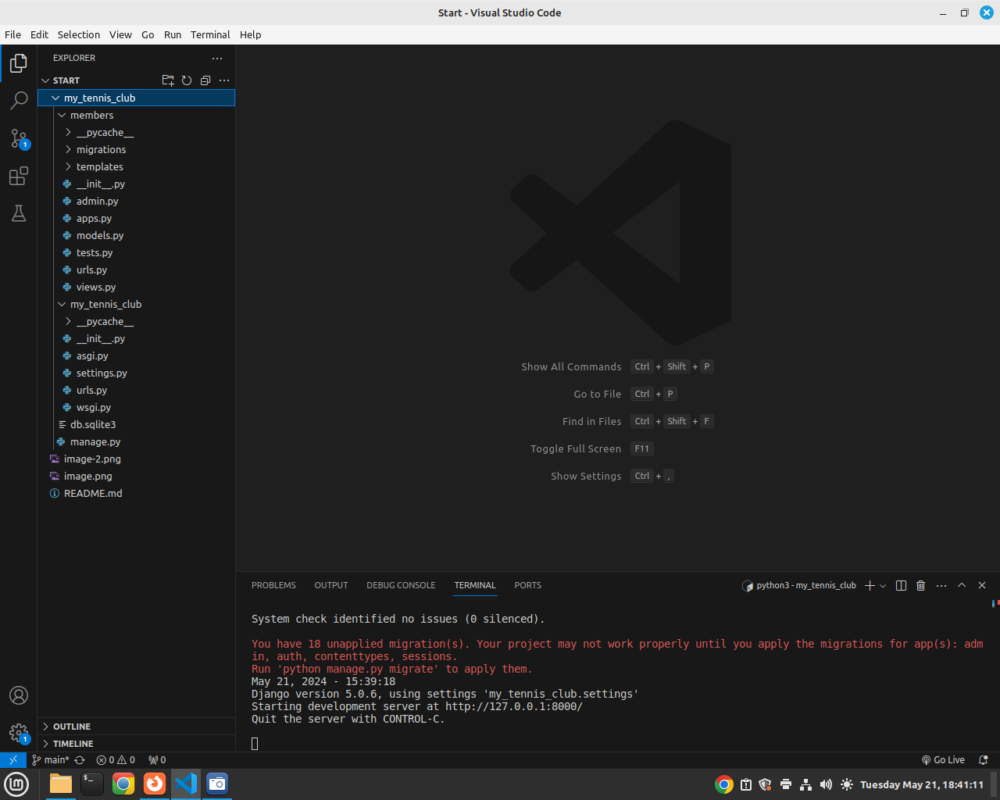

##  Python Django Program
### What is Django?

Django is a Python framework that makes it easier to create web sites using Python.
<br>
Django takes care of the difficult stuff so that you can concentrate on building your web applications.
<br>
Django emphasizes reusability of components, also referred to as DRY (Don't Repeat Yourself), and comes with ready-to-use features like login system, database connection and CRUD operations (Create Read Update Delete).

### How does Django Work?

#### Django follows the MVT design pattern (Model View Template).

Model - The data you want to present, usually data from a database. 
<br> <br>
View - A request handler that returns the relevant template and content - based on the request from the user.
<br> <br>
Template - A text file (like an HTML file) containing the layout of the web page, with logic on how to display the data.
<br> <br>

## Creating a Website in Django
In this Section, we will create a Django based website named 'my tennis club'. Its a website for a Tenis Club.
<br><br>

#### Install Django in Linux
To install django type below command in Terminal<br>
```python -m pip install Django```

#### Check Installed Django version
To check django version type below command in Terminal<br>
```django-admin --version```


### Creating a New Project.
In VS Code Terminal navigate to your desktop. Type below command <br>
``` django-admin startproject my_tennis_club``` 

Above command creates a New Project.

<br>
Run your Project.
In Terminal hange Directory to my_tennis_club folder type below command to run your app <br>

``` python3 manage.py runserver ```

<br><br>
Open a new browser window and type 127.0.0.1:8000 in the address bar.


### What's Next?
We have a Django project! <br>
The next step is to make an app in your project. <br>
You cannot have a web page created with Django without an app.<br>
<br><br>
Start by navigating to the selected location where you want to store the app, in my case the my_tennis_club folder, and run the command below.<br>

```py manage.py startapp members ```

Django creates a folder named members in my project, with this content: <br>
Please Note we have two folders <br>1. A Folder named members - this is the App Folder with files inside<br>2. my tenis club folder, this is a Folder for the whole Project with Files inside.
<br> See below screenshot.



### Explanation
    __init__.py − Just to make sure python handles this folder as a package.

    admin.py − This file helps you make the app modifiable in the admin interface.

    models.py − This is where all the application models are stored.

    tests.py − This is where your unit tests are.

    views.py − This is where your application views are.


### Views

Django views are Python functions that takes http requests and returns http response, like HTML documents.<br>

A web page that uses Django is full of views with different tasks and missions.<br>

Views are usually put in a file called views.py located on your app's folder.<br>

There is a views.py in your members folder that looks like this:<br>
my_tennis_club/members/views.py:
```
        from django.shortcuts import render

        # Create your views here.
```
<br><br>
Update your views.py to look like below
Here we create a Function Home(a View) that returns a Hello World response. <br>

        from django.shortcuts import render
        from django.http import HttpResponse

        def home(request):
            return HttpResponse("Hello World")


<br> <br>
This is a simple example on how to send a response back to the browser.

But how can we execute the view? Well, we must call the view via a URL. <br>

## URLs

Create a file named urls.py in the same folder as the views.py file, and type this code in it:


